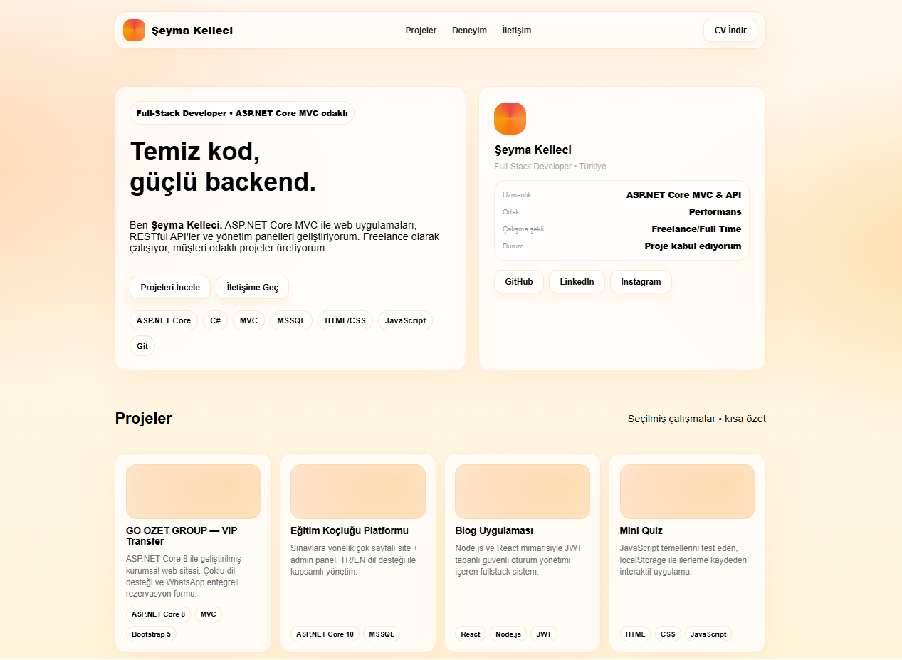
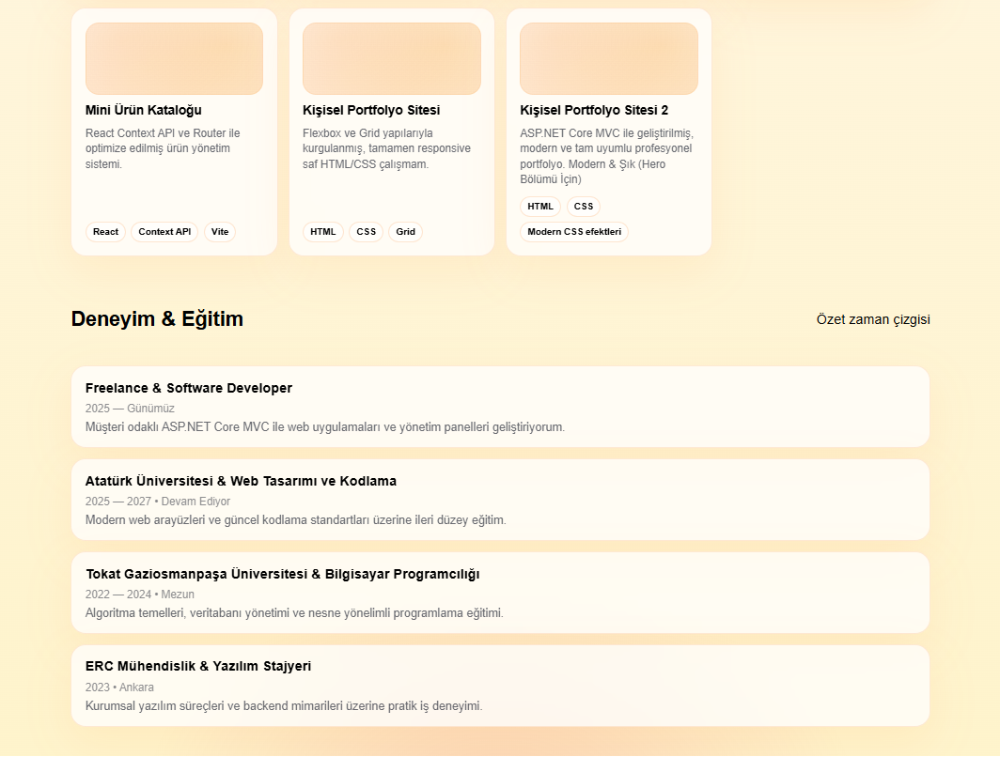
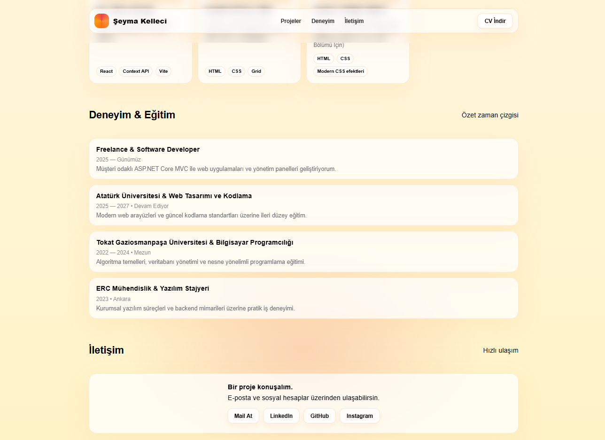

# 🧑‍💻 Şeyma Kelleci — Kişisel Portfolyo Sitesi

Yazılım geliştirme öğrenme sürecimde yaptığım **deneme portfolyo projesi**. Saf HTML & CSS kullanarak kendimi tanıtan, projelerimi ve deneyimlerimi listeleyen basit bir kişisel site. Herhangi bir framework ya da kütüphane kullanmadan, temel web teknolojileriyle neler yapılabileceğini görmek için oluşturdum.

---

## 💡 Neden Yaptım?

- HTML & CSS bilgimi pekiştirmek
- Flexbox ve Grid kullanımını gerçek bir projede uygulamak
- Glassmorphism ve gradient gibi modern CSS efektlerini denemek
- Kendimi tanıtan bir sayfa oluşturmak

Bu site bir **ödev ve pratik çalışmasıdır** — üretim ortamı için hazırlanmış bir proje değildir.

---

## 📁 Proje Yapısı

```
portfolio/
├── index.html         # Tek dosyadan oluşan tüm sayfa
├── cv.pdf             # İndirilebilir CV
├── screenshot.png     # Site önizleme görseli 1
├── screenshot1.png    # Site önizleme görseli 2
├── screenshot2.png    # Site önizleme görseli 3
└── README.md          # Proje açıklaması
---

## ✨ Neler Var?

- **Sticky Header** — Kaydırınca yerinde kalan, bulanık arka planlı navigasyon
- **Hero Bölümü** — Sol tanıtım + sağ profil kartı (CSS Grid ile iki sütun)
- **Projeler Grid** — 7 proje kartı, otomatik sıralanan responsive grid
- **Zaman Çizgisi** — Eğitim ve deneyim bilgileri
- **İletişim Bölümü** — Sosyal medya ve e-posta linkleri
- **CV İndirme** — Navigasyondan tek tıkla PDF indirme
- **Mobil Uyumlu** — 768px altında tek sütuna geçen responsive yapı

---

## 🛠️ Kullanılan Teknolojiler

| Teknoloji | Ne İşe Yaradı? |
|-----------|---------------|
| HTML5 | Sayfa yapısı |
| CSS3 | Tasarım, Flexbox, Grid, animasyonlar |
| — | Harici kütüphane yok, framework yok |

> **Not:** Hiçbir kurulum gerekmez. Dosyayı tarayıcıda açmak yeterli.

---

## 🎨 Denediğim CSS Teknikler

- `radial-gradient` ve `conic-gradient` ile arka plan efektleri
- `backdrop-filter: blur()` ile glassmorphism kart tasarımı
- `CSS Grid` + `auto-fill / minmax` ile responsive kart grid'i
- `position: sticky` ile kaydırma sırasında yerinde kalan header
- `transition` ile hover animasyonları

---

## 📌 Sayfanın Bölümleri

| Bölüm | Anchor |
|-------|--------|
| Projeler | `#projeler` |
| Deneyim & Eğitim | `#deneyim` |
| İletişim | `#iletisim` |

---

## 🔗 İletişim

- **GitHub:** [github.com/symkllci](https://github.com/symkllci)
- **LinkedIn:** [linkedin.com/in/şeyma-k-411530249](https://www.linkedin.com/in/şeyma-k-411530249)
- **Instagram:** [@sheymacodding](https://www.instagram.com/sheymacodding)
- **E-posta:** seyma.kelleci@gmail.com

---


## 📸 Önizleme






---

> Geliştirici: **Şeyma Kelleci** • Öğrenme & Pratik Projesi
